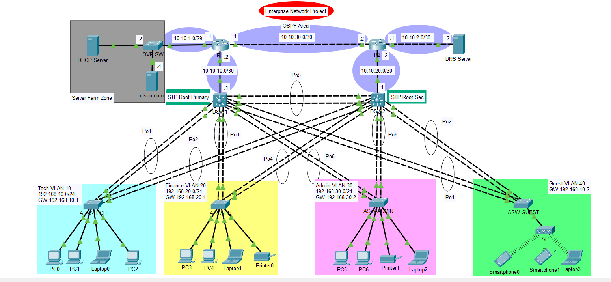

# Enterprise Network Infrastructure Lab

A redundant, segmented enterprise LAN built and tested end-to-end in Cisco Packet Tracer — designed as hands-on practice for the **NTI (National Telecommunication Institute) Network Infrastructure track**, applying CCNA curriculum concepts in a full working topology.



## Overview

This lab simulates a multi-department enterprise network with dual redundant distribution switches, dynamic routing, centralized services, and department-level segmentation and access control.

**Core design goals:**
- Segment traffic by department while keeping inter-department routing dynamic and scalable
- Provide link- and switch-level redundancy with no single point of failure at the distribution layer
- Centralize DHCP/DNS instead of running them per-VLAN
- Restrict guest traffic to only what it needs (DNS + external), nothing internal

## Key Implementations

| Area | Technology |
|---|---|
| Network segmentation | VLANs (Tech, Finance, Admin, Guest) |
| Inter-VLAN routing | Layer 3 SVIs on distribution switches |
| Redundancy (links) | LACP EtherChannel |
| Loop prevention | Rapid PVST+ |
| Dynamic routing | OSPF (single area) |
| IP addressing | Centralized DHCP with `ip helper-address` relay |
| Security | Extended ACL restricting the Guest VLAN |
| Wireless | AP with WPA2-PSK for guest devices |

## Topology

Each access switch is dual-homed to **both** DSW1 and DSW2 via LACP EtherChannel bundles. RSTP keeps one uplink forwarding and the other blocking per VLAN, so a distribution-switch or link failure fails over without a topology loop.

## IP Addressing

### Routed links

| Link | Subnet | Endpoints |
|---|---|---|
| Server LAN | 10.10.1.0/29 | R1 ↔ SVR-SW segment (DHCP Server, cisco.com) |
| R1 ↔ DSW1 | 10.10.10.0/30 | R1: .2 · DSW1: .1 |
| R2 ↔ DSW2 | 10.10.20.0/30 | R2: .2 · DSW2: .1 |
| R1 ↔ R2 backbone | 10.10.30.0/30 | R1: .1 · R2: .2 |
| DNS LAN | 10.10.2.0/30 | R2: .1 · DNS Server: .2 |

### VLANs

| VLAN | Name | Subnet | Gateway | Access Switch | Owning Distribution SW |
|---|---|---|---|---|---|
| 10 | TECH | 192.168.10.0/24 | 192.168.10.1 | ASW-TECH | DSW1 |
| 20 | FINANCE | 192.168.20.0/24 | 192.168.20.1 | ASW-FIN | DSW1 |
| 30 | ADMIN | 192.168.30.0/24 | 192.168.30.2 | ASW-ADMIN | DSW2 |
| 40 | GUEST | 192.168.40.0/28 | 192.168.40.2 | ASW-GUEST + AP | DSW2 |

## Repository Structure

```
enterprise-network-lab/
├── README.md
├── Topology.png
├── Project.pkt
└── configs/
    ├── R1.txt
    ├── R2.txt
    ├── DSW1.txt
    ├── DSW2.txt
    ├── ASW-TECH.txt
    ├── ASW-FIN.txt
    ├── ASW-ADMIN.txt
    └── ASW-GUEST.txt
```

> **Note:** All passwords, enable secrets, and the WPA2 passphrase in the config files are redacted (`<REDACTED>`) before being committed. Only redacted copies should ever be pushed to a public repo.

## How to Open

1. Install [Cisco Packet Tracer](https://www.netacad.com/courses/packet-tracer) (this lab was built on version 9.0.1.0858).
2. Open `Project.pkt`.
3. Config files under `configs/` are provided for reference/review — they mirror what's loaded in the `.pkt` file.

## Testing Performed

- [x] Each VLAN pulls a correct DHCP lease from the centralized DHCP server via relay
- [x] Intra-VLAN and inter-VLAN connectivity confirmed via ping
- [x] Guest VLAN blocked from reaching Tech/Finance/Admin subnets, confirmed via ACL
- [x] `show etherchannel summary` confirms all Port-channels bundled (`SU`) on both distribution switches
- [x] `show spanning-tree vlan <id>` confirms one uplink forwarding, one blocking, per VLAN as designed
- [x] OSPF adjacencies verified with `show ip ospf neighbor` across R1, R2, DSW1, DSW2

## Notes & Troubleshooting Lessons

A few real issues hit while building this, worth documenting for anyone doing the same lab:

- **Trunk encapsulation on 3560-series switches**: `switchport mode trunk` is rejected until `switchport trunk encapsulation dot1q` is set first — the switch defaults to "auto" and won't let you pick trunk mode blind.
- **Stale Port-channel interfaces**: if a `channel-group` command fails partway through, IOS can leave a half-configured Port-channel behind. Deleting it (`no interface port-channel X`) and letting it regenerate from correctly-configured member ports resolves "vlan mask is different" errors that don't correspond to any real config mismatch.
- **`no interface port-channel X` only works in config mode** — running it from privileged EXEC silently fails and looks like nothing happened.
- Always verify with `show etherchannel summary` (looking for `SU` status and `(P)` on member ports) rather than trusting that a channel-group command without an error means the bundle actually came up.

## Author

Built as part of the **NTI Network Infrastructure track**, applied alongside CCNA coursework.

Feel free to open an issue or reach out if you're working through a similar build and get stuck.
